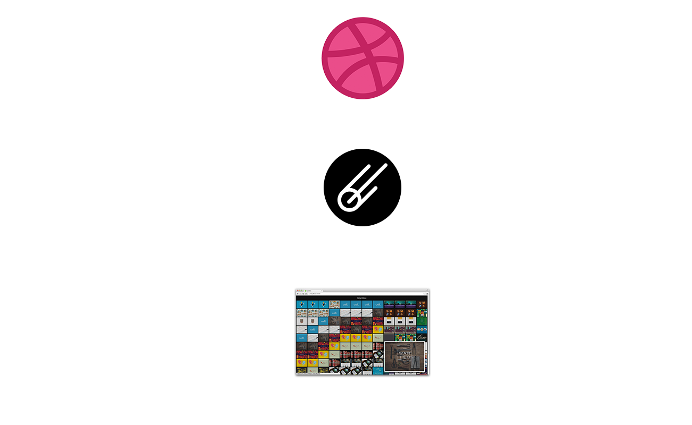

# Meteor 101
###Sacha Greif

@SachaGreif

DiscoverMeteor.com
<a href="javascript:void(0)" class="commit-link" data-value="c1-2">Start</a>


# So What's Meteor?


## Client-Side JavaScript
jQuery, Backbone, Angular, Ember


## Server-Side JavaScript
Node


## Full-Stack JavaScript
Meteor is a JavaScript framework with both server-side and client-side components.


# 3 Things You Need To Know About Meteor


## Data on the Wire
The client front-loads all HTML, CSS, and JavaScript code necessary to the app when you first connect, then after that only receives data. 


## Database Everywhere
Meteor replicates a subset of the database in the browser's memory for easy access.


## Reactivity
Any modification to the database is reflected in real-time on the client.


# A Few More Cool Things…


## Everything Included
Meteor automatically loads any HTML, CSS, or JavaScript file included in a repository.


## Hot Code Reload
Any change to an app's source code automatically triggers a browser refresh.


# The Meteor Stack


## Node
For the server.
```bash
node app.js
```


## MongoDB
For the database.
```js
Users.find({name: 'Sacha'});
```


## Handlebars
For the templates.
```html
{{#each myArray}}
  <li>{{item}}</li>
{{/each}}
```


## jQuery
For DOM manipulation.
```js
'.button click': function () {
  $('.links').addClass('inactive');
}
```


## Underscore
For utility functions.
```js
_.pluck(imagesJSONArray, 'url');
```


## Review
Meteor takes existing technologies and makes them work together seamlessly, on both client and server. 


# What We're Building


## Dribbble
A community site that lets you post and vote on design work.


<p></p>
The Dribbble homepage: the 12 most popular “shots”.


## Grid + Dribbble = Gribbble
Showing the Dribbble homepage over the past 12 hours. 


<p></p>
A grid of the homepage over time.


<p></p>
Collect data, then display it. 


 
<a href="javascript:void(0)" class="commit-link" data-value="master">Show Me!</a>


# Chapter 1: Setting Up


## Install Meteor
```bash
curl https://install.meteor.com | /bin/sh
```


## Create an App
Create the app.
```bash
meteor create gribbble
```
Open the app's directory.
```bash
cd gribbble
```


## Run the App
```bash
meteor
```
<a href="javascript:void(0)" class="commit-link toggle-frame" data-value="c1-1">Run</a>


## Create the File Structure
- Remove Meteor's placeholder files.
```bash
rm gribbble.css gribbble.html gribbble.js
```
- Create three directories
```bash
mkdir client
mkdir server
mkdir collections
```
- Copy-paste the stylesheet into `client/style.css`.
<a href="javascript:void(0)" class="commit-link" data-value="c1-2">Run</a>


## Review
We now have a working Meteor app. Let's make it actually do something!


# Chapter 2: Collecting Data


## Create a Collection
```js
Snapshots = new Meteor.Collection('snapshots');
```
`/collections/snapshots.js` (both)
<a href="javascript:void(0)" class="commit-link" data-value="c1-3">Run</a>
<p class="test">`Snapshots.find().fetch()`</p>


## Query the Dribbble API
```bash
meteor add http
```

```js
var url="http://api.dribbble.com/shots/popular?per_page=12";

var queryAPI = function () {
  HTTP.get(url, function(error, result){
    if(result){
      result.timestamp = new Date().getTime();
      Snapshots.insert(result);
    }
  });
}
```
`/server/api.js` (server)
<a href="javascript:void(0)" class="commit-link" data-value="c1-4">Run</a>


## Schedule to Run Every Hour
```js
Meteor.setInterval(function(){
  queryAPI();
}, 3600000);
```
`server/api.js` (server)
<a href="javascript:void(0)" class="commit-link" data-value="c1-5">Run</a>


## Test the Function
```js
Meteor.methods({
  queryFromClient: queryAPI
});
```
`server/api.js` (server)
<a href="javascript:void(0)" class="commit-link" data-value="c1-6">Run</a>
<p class="test">`Meteor.call('queryFromClient')`</p>


## Review
We're now collecting the 12 most popular Dribbble shots every hour. Next step: displaying them. 


# Chapter 3: Displaying Data


## Loading Data
Let's preload data into our database.
<a href="javascript:void(0)" class="commit-link" data-value="load_data">Load Data</a>


## Set Up Our Main Template
```html
<head>
  <title>Gribbble</title>
</head>

<body>
  <h1>Gribbble</h1>
  {{> grid}}
</body>
```
`/client/main.html` (client)
<a href="javascript:void(0)" class="commit-link" data-value="c2-1">Run</a>


## Make a Grid
```html
<template name="grid">
  <div class="grid">
    {{#each snapshots}}
      <div class="grid-snapshot grid-col">
        {{timestamp}}
      </div>
    {{/each}}
  </div>
</template>
```
`/client/grid.html` (client)
<a href="javascript:void(0)" class="commit-link" data-value="c2-2">Run</a>


## Fill The Grid With Data
```js
Template.grid.helpers({
  snapshots: function () {
    return Snapshots.find({}, {
      sort: {timestamp: -1}, 
      limit: 12
    });
  }
});
```
`/client/grid.js` (client)
<a href="javascript:void(0)" class="commit-link" data-value="c2-3">Run</a>


## Loop Over The Shots
```html
<template name="grid">
  <div class="grid">
    {{#each snapshots}}
      <div class="grid-snapshot grid-col">
        {{#each data.shots}}
          <p>{{title}}</p>
        {{/each}}
      </div>
    {{/each}}
  </div>
</template>
```
`/client/grid.html` (client)
<a href="javascript:void(0)" class="commit-link" data-value="c2-4">Run</a>


## Add Shot Template
```js
<template name="shot">
  <a href="{{url}}" target="_blank" class="grid-shot">
    
  </a>
</template>
```
`/client/shot.html` (client)
<a href="javascript:void(0)" class="commit-link" data-value="c2-5">Run</a>


## Include Shot Template
```html
<template name="grid">
  <div class="grid">
    {{#each snapshots}}
      <div class="grid-snapshot grid-col">
        {{#each data.shots}}
          {{>shot}}
        {{/each}}
      </div>
    {{/each}}
  </div>
</template>
```
`/client/grid.html` (client)
<a href="javascript:void(0)" class="commit-link" data-value="c2-6">Run</a>


## Review
We're storing and displaying data. We now need to control the flow of data from server to client. 


# Chapter 4: Controlling Data


## Remove Packages
```bash
meteor remove autopublish
meteor remove insecure
```
<a href="javascript:void(0)" class="commit-link" data-value="c3-1">Run</a>
<p class="test">`Snapshots.find().fetch()`</p>


## Add a Publication
```js
Meteor.publish('snapshots', function(limit) {
  return Snapshots.find({}, {
    sort: {timestamp: -1}, 
    limit: limit
  });
});
```
`/server/publications.js` (server)
<a href="javascript:void(0)" class="commit-link" data-value="c3-2">Run</a>


## Subscribe to the Publication
```js
Meteor.subscribe('snapshots', 12);
```
`/client/main.js` (client)
<a href="javascript:void(0)" class="commit-link" data-value="c3-3">Run</a>
<p class="test">`Snapshots.find().fetch()`</p>


## Review
We've set rules controlling what data is made available to the client, as well as what part of the data the client will actually ask for. Now let's get fancy.


# Chapter 5: Getting Fancy


## Set Up Hover Events
```js
Template.shot.events({
  'mouseenter': function (event) {
    Session.set('zoomedShot', this);
  },
  'mouseleave': function (event) {
    Session.set('zoomedShot', null);
  }
});
```
`/client/shot.js` (client)
<a href="javascript:void(0)" class="commit-link" data-value="c4-1">Run</a>
<p class="test">`Session.get('zoomedShot')`</p>


## Add a Zoom Template
`/client/shot.js` (client)
```html
<template name="zoom">
  <div class="zoom-shot">
    {{> shot zoomedShot}}
  </div>
</template>
```
`/client/zoom.html` (client)
<a href="javascript:void(0)" class="commit-link" data-value="c4-2">Run</a>


## Add the Zoom Helper
```js
Template.zoom.helpers({
  zoomedShot: function () {
    return Session.get('zoomedShot');
  }
});
```
`/client/zoom.js` (client)
<a href="javascript:void(0)" class="commit-link" data-value="c4-3">Run</a>


## Include the Zoom Template
```html
<body>
  <h1>Gribbble</h1>
  {{> grid}}
  {{> zoom}}
</body>
```
`/client/main.html` (client)
<a href="javascript:void(0)" class="commit-link" data-value="c4-4">Run</a>


## Add a Parameter to the Publication
```js
Meteor.publish('snapshots', function(limit, skip) {
  return Snapshots.find({}, {
    sort: {timestamp: -1}, 
    limit: limit, 
    skip: skip
  });
});
```
`/server/publications.js` (server)
<a href="javascript:void(0)" class="commit-link" data-value="c4-5">Run</a>


## Add a Parameter to the Subscription
```js
Session.get('skip', 0);

Deps.autorun(function(){
  Meteor.subscribe('snapshots', 12, Session.get('skip'));
});
```
`/client/main.js` (client)
<a href="javascript:void(0)" class="commit-link" data-value="c4-6">Run</a>
<p class="test">`Session.set('skip', Session.get('skip')+1)`</p>


## Add a Loading Screen
```html
<body>
  <h1>Gribbble</h1>
  {{> grid}}
  {{> zoom}}
  <div class="loading"></div>
</body>
```
`/client/main.html` (client)
<a href="javascript:void(0)" class="commit-link" data-value="c4-7">Run</a>


## Hide the Loading Screen
```js
Deps.autorun(function(){
  Meteor.subscribe('snapshots', Session.get('offset'), 
    function () {
      $('.loading').fadeOut('slow');
    });
});
```
`/client/main.js` (client)
<a href="javascript:void(0)" class="commit-link" data-value="c4-8">Run</a>


