# Introduction to Meteor
### Learning a Framework in 30 Minutes


# How It All Started


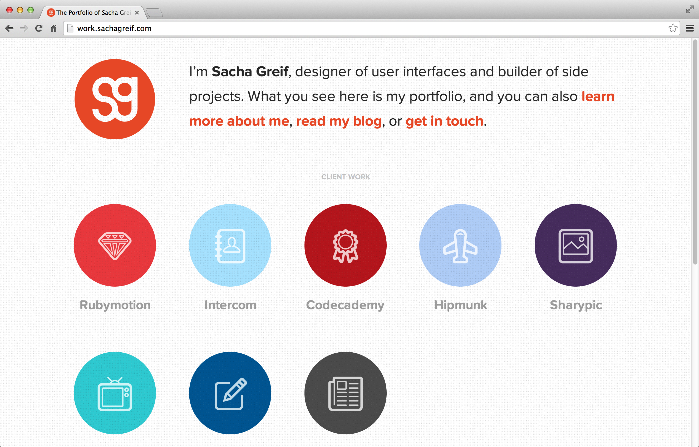


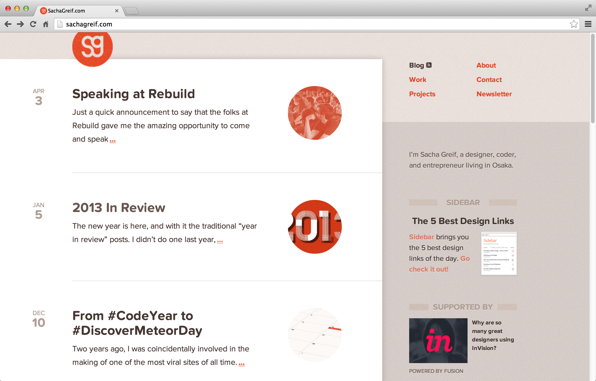


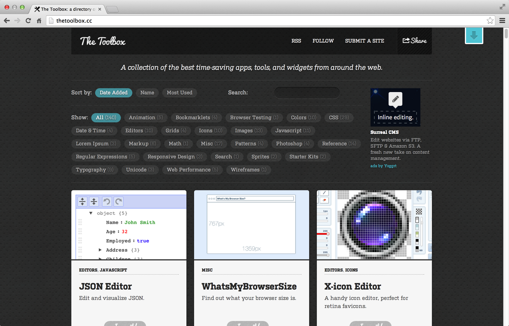


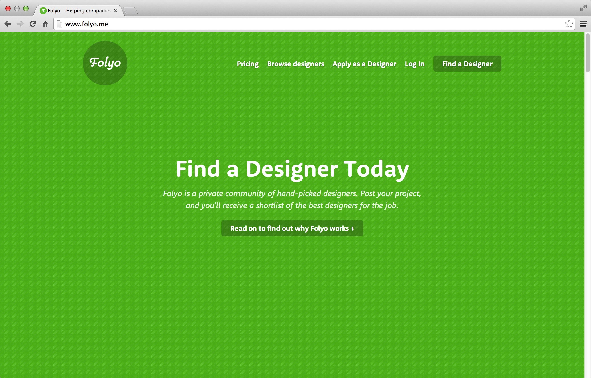


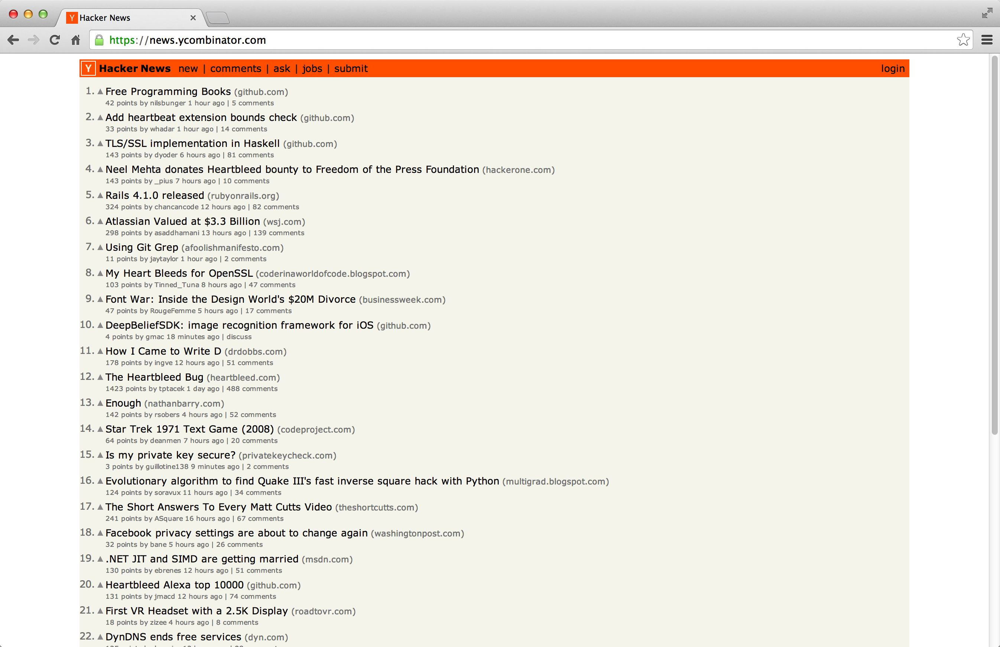
Note:
At the time, there wasn't anything like Hacker News for designers. 


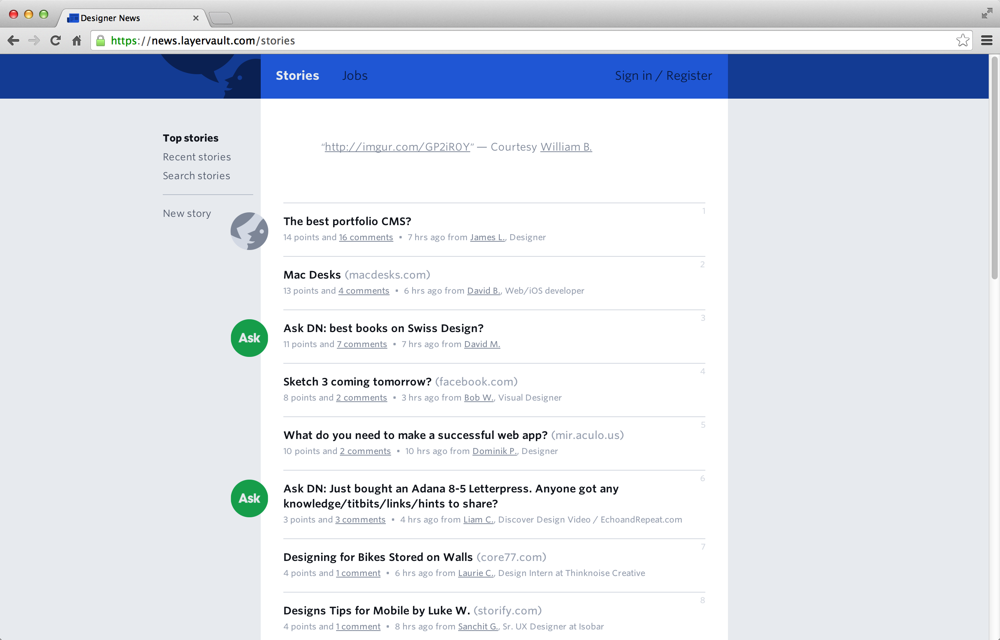


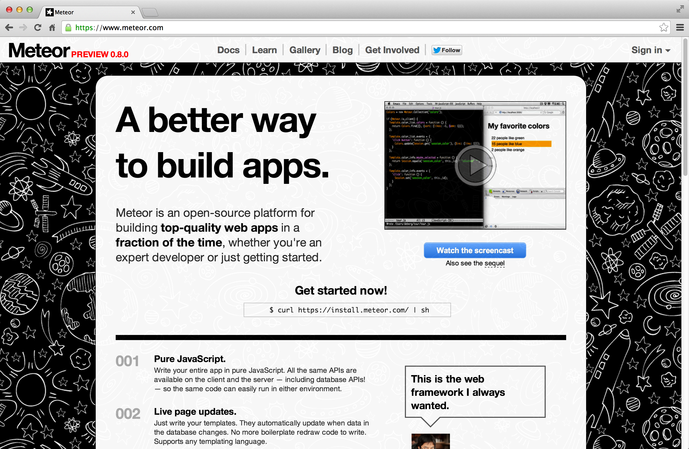
Note:
“Wow, a new, experimental, undocumented web framework! What a great way to save some time!”


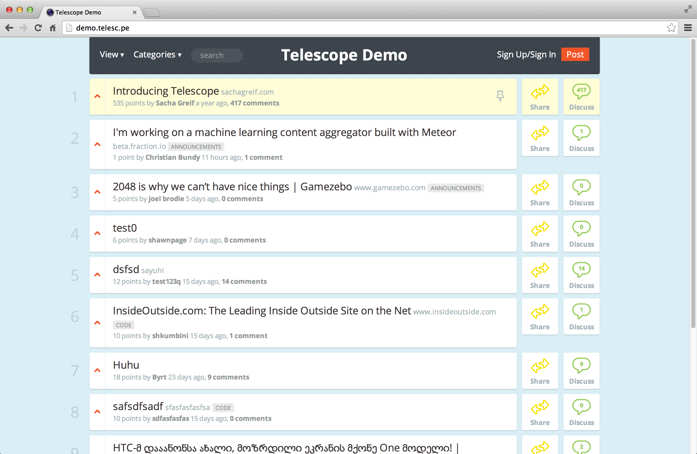


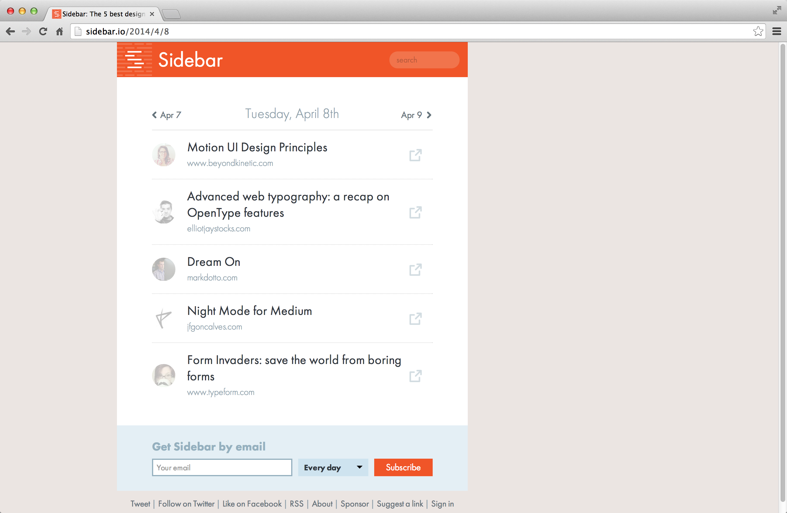


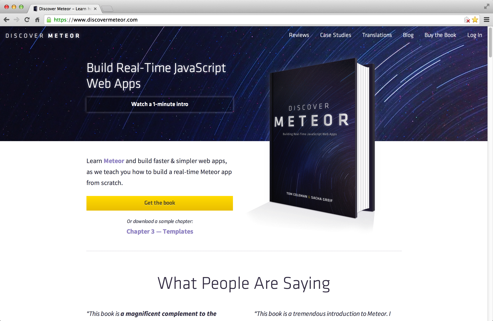
<!-- <p></p> -->


# So What's Meteor?


## Client-Side JavaScript


## Server-Side JavaScript


## Full-Stack JavaScript

<!-- Meteor is a JavaScript framework with both server-side and client-side components. -->
<!-- # Three Meteor Principles -->


## Data on the Wire

<!-- The client front-loads all HTML, CSS, and JavaScript code necessary to the app when you first connect, then after that only receives data.  -->


## Database Everywhere

<!-- Meteor replicates a subset of the database in the browser's memory for easy access. -->


## Reactivity

<!-- Any modification to the server-side database is reflected in real-time on the client. -->
<!-- # A Few More Cool Things… -->
<!-- ## Everything Included -->
<!-- Meteor automatically loads any HTML, CSS, or JavaScript file included in a repository. -->
<!-- ## Hot Code Reload -->
<!-- Any change to an app's source files automatically triggers a browser refresh. -->
Note:
Meteor takes existing technologies and makes them work together seamlessly, on both client and server. 


# What We're Building


<p></p>
Note:
The Dribbble homepage: the 12 most popular “shots”.


## Grid + Dribbble =


<!-- <p>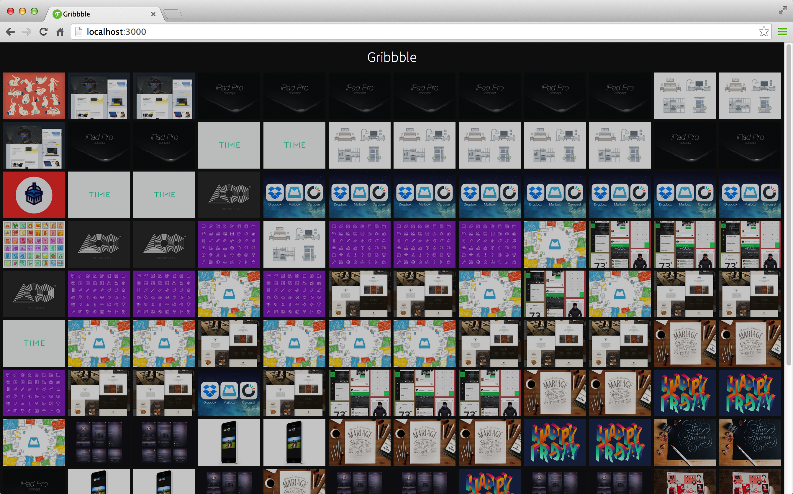</p> -->
<p></p>
Note: that's the end of the section with pretty images, it's all code from now on.
<!-- <a href="javascript:void(0)" class="commit-link" data-value="master">Show Me!</a> -->


# Setting Up


## Install Meteor
```bash
curl https://install.meteor.com | /bin/sh
```


## Create an App
Create the app.
```bash
meteor create gribbble
```
Open the app's directory.
```bash
cd gribbble
```


## Run the App
```bash
meteor
```
<a href="javascript:void(0)" class="commit-link" data-value="c1-1">Run</a>


## Remove Meteor's placeholder files.
```bash
gribbble.css 
gribbble.html 
gribbble.js
```


## Create three directories
```bash
/client
/server
/collections
```


## Add a stylesheet
Copy-paste the stylesheet into `client/style.css`.
<a href="javascript:void(0)" class="commit-link" data-value="c1-2">Run</a>
<!-- ## Recap -->
<!-- We now have a working Meteor app. Let's make it actually do something! -->


### Collecting Data
<p>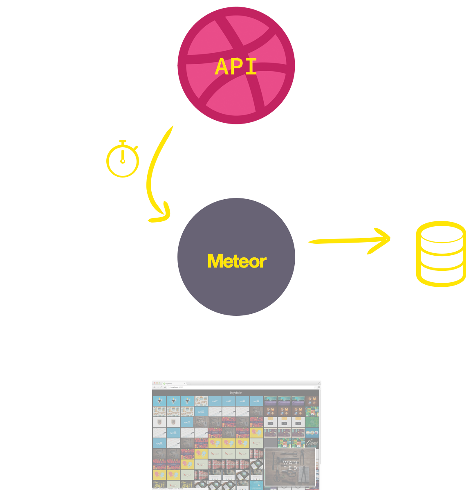</p>


## Create a Collection
```js
Snapshots = new Meteor.Collection('snapshots');
```
<div class="file">`/collections/snapshots.js` (both)</div>
<div class="highlight" data-coordinates="[null, 'top:111px; left: 56px; height: 40px; width: 134px;', 'top:111px; left: 275px; height: 40px; width: 244px;', 'top:111px; left: 525px; height: 40px; width: 150px;']"></div>
<!-- <a href="javascript:void(0)" class="commit-link" data-value="c1-3">Run</a> -->
<!-- <p class="test">`Snapshots.find().fetch()`</p> -->
<!-- ## The Dribbble API -->
<!-- <div class="smaller">`http://api.dribbble.com/shots/popular?per_page=12`</div> -->


## Add the HTTP Package
```bash
meteor add http
```


## Query the Dribbble API
```js
var url="http://api.dribbble.com/shots/popular?per_page=12";

var queryAPI = function () {
  HTTP.get(url, function(error, result){
    if(result){
      result.timestamp = new Date().getTime();
      Snapshots.insert(result);
    }
  });
}
```
<div class="file">`/server/api.js` (server)</div>
<!-- <a href="javascript:void(0)" class="commit-link" data-value="c1-4">Run</a> -->
<div class="highlight" data-coordinates="[null, 'top:113px; left: 54px; height: 37px; width: 806px;', 'top:190px; left: 54px; height: 37px; width: 397px;', 'top:230px; left: 81px; height: 37px; width: 537px;', 'top:307px; left: 137px; height: 37px; width: 559px;', 'top:346px; left: 137px; height: 37px; width: 355px;']"></div>


## Schedule to Run Every Hour
```js
Meteor.setInterval(queryAPI, 3600000);
```
<div class="file">`/server/api.js` (server)</div>
<!-- <a href="javascript:void(0)" class="commit-link" data-value="c1-5">Run</a> -->
<!-- ## Recap -->
<!-- We're now collecting the 12 most popular Dribbble shots every hour. Next step: displaying them.  -->


### Displaying Data


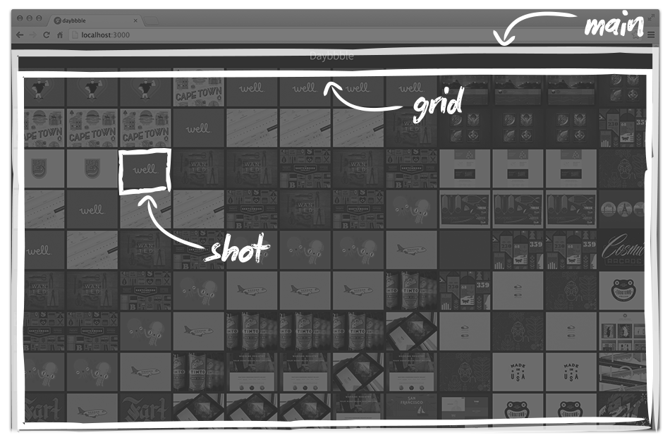


## The `main` Template
```html
<head>
  <title>Gribbble</title>
</head>

<body>
  <h1>Gribbble</h1>
  {{> grid}}
</body>
```
<div class="file">`/client/main.html` (client)</div>
<div class="highlight" data-coordinates="[null, 'top:347px; left: 86px; height: 37px; width: 149px;']"></div>
<!-- <a href="javascript:void(0)" class="commit-link" data-value="c2-1">Run</a> -->


## The `grid` Template
```html
<template name="grid">
  <div class="grid">
    {{#each snapshots}}
      <div class="grid-snapshot grid-col">
        {{timestamp}}
      </div>
    {{/each}}
  </div>
</template>
```
<div class="file">`/client/grid.html` (client)</div>
<div class="highlight" data-coordinates="[null, 'top:112px; left: 56px; height: 37px; width: 318px;', 'top:190px; left: 115px; height: 37px; width: 267px;', 'top:268px; left: 166px; height: 37px; width: 187px;']"></div>
<!-- <a href="javascript:void(0)" class="commit-link" data-value="c2-2">Run</a> -->


## The `find()` Syntax
```js
collection.find(selector, options);
```
- `selector`: what to find.
- `options`: sort, limit, etc.


## Fill The Grid With Data
```js
Template.grid.helpers({
  snapshots: function () {
    return Snapshots.find(
      {}, 
      {
        sort: {timestamp: -1}, 
        limit: 12
      }
    );
  }
});
```
<div class="file">`/client/grid.js` (client)</div>
<a href="javascript:void(0)" class="commit-link" data-value="c2-3">Run</a>
<div class="highlight" data-coordinates="[null, 'top:111px; left: 54px; height: 40px; width: 331px;', 'top:150px; left: 81px; height: 40px; width: 344px;', 'top:189px; left: 111px; height: 40px; width: 312px;', 'top:229px; left: 142px; height: 40px; width: 40px;', 'top:270px; left: 142px; height: 152px; width: 340px;']"></div>


## Loop Over The Shots
```html
<template name="grid">
  <div class="grid">
    {{#each snapshots}}
      <div class="grid-snapshot grid-col">
        {{#each data.shots}}
          <p>{{title}}</p>
        {{/each}}
      </div>
    {{/each}}
  </div>
</template>
```
<div class="file">`/client/grid.html` (client)</div>
<a href="javascript:void(0)" class="commit-link" data-value="c2-4">Run</a>
<div class="highlight" data-coordinates="[null, 'top:189px; left: 110px; height: 40px; width: 271px;', 'top:267px; left: 167px; height: 40px; width: 283px;', 'top:306px; left: 191px; height: 40px; width: 233px;']"></div>


## The `shot` Template
```js
<template name="shot">
  <a href="{{url}}" target="_blank" class="grid-shot">
    
  </a>
</template>
```
<div class="file">`/client/shot.html` (client)</div>
<div class="highlight" data-coordinates="[null, 'top:111px; left: 56px; height: 40px; width: 314px;', 'top:151px; left: 212px; height: 40px; width: 98px;', 'top:189px; left: 253px; height: 40px; width: 275px;']"></div>
<!-- <a href="javascript:void(0)" class="commit-link" data-value="c2-5">Run</a> -->


## Include Shot Template
```html
<template name="grid">
  <div class="grid">
    {{#each snapshots}}
      <div class="grid-snapshot grid-col">
        {{#each data.shots}}
          {{>shot}}
        {{/each}}
      </div>
    {{/each}}
  </div>
</template>
```
<div class="file">`/client/grid.html` (client)</div>
<div class="highlight" data-coordinates="[null, 'top:307px; left: 195px; height: 40px; width: 132px;']"></div>
<a href="javascript:void(0)" class="commit-link" data-value="c2-6">Run</a>
<!-- ## Recap -->
<!-- We're storing and displaying data. We now need to control the flow of data from server to client.  -->


### Controlling Data
<p></p>


## Remove Packages
```bash
meteor remove autopublish
meteor remove insecure
```
<a href="javascript:void(0)" class="commit-link" data-value="c3-1">Run</a>
<!-- <p class="test">`Snapshots.find().fetch()`</p> -->


### Your Data
<p></p>


### Publishing
<p>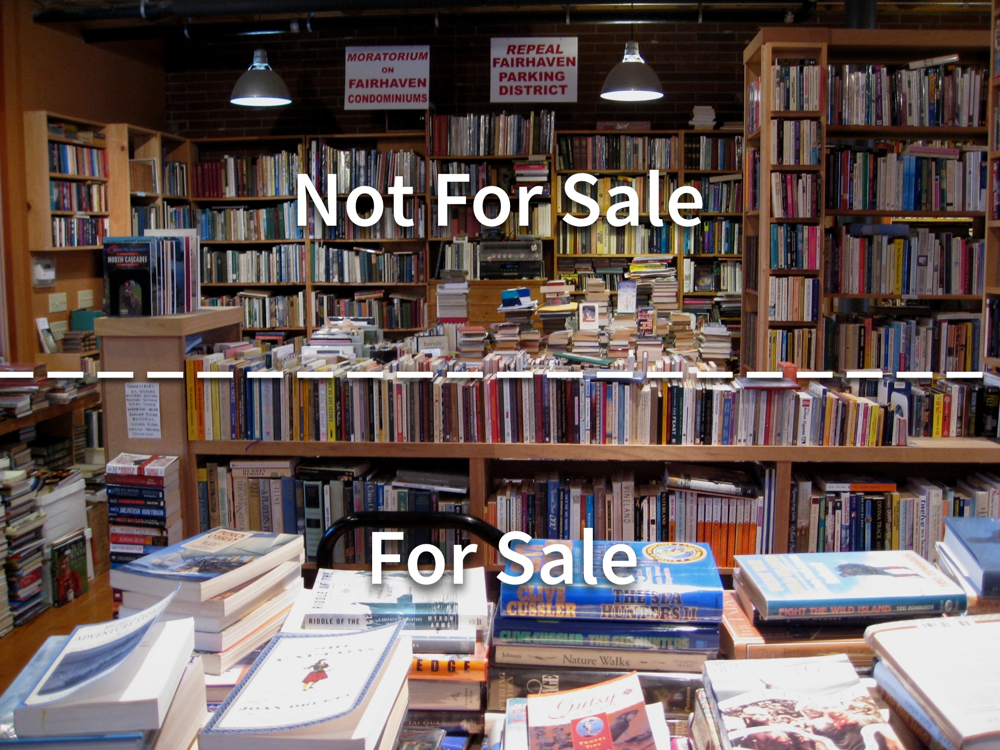</p>


### Subscribing
<p></p>


## Add a Publication
```js
Meteor.publish('snapshots', function(clientLimit) {
  return Snapshots.find(
    {}, 
    {
      sort: {timestamp: -1}, 
      limit: clientLimit
    }
  );
});
```
<div class="file">`/server/publications.js` (server)</div>
<div class="highlight" data-coordinates="[null, 'top:111px; left: 53px; height: 40px; width: 208px;', 'top:111px; left: 263px; height: 40px; width: 158px;', 'top:111px; left: 555px; height: 40px; width: 178px;', 'top:150px; left: 83px; height: 273px; width: 373px;', 'top:305px; left: 231px; height: 40px; width: 169px;']"></div>
<!-- <a href="javascript:void(0)" class="commit-link" data-value="c3-2">Run</a> -->


## Subscribe to the Publication
```js
Meteor.subscribe('snapshots', 12);
```
<div class="file">`/client/main.js` (client)</div>
<a href="javascript:void(0)" class="commit-link" data-value="c3-3">Run</a>
<!-- <p class="test">`Snapshots.find().fetch()`</p> -->
<!-- ## Recap -->
<!-- We built a simple web app in less than 100 lines of code, and saw an overview of the main Meteor features.  -->


<p></p>


## Learn More
<p></p>
<!-- - [Learn Meteor](https://www.meteor.com/learn-meteor) -->
<!-- - [Discover Meteor](https://www.discovermeteor.com) -->
<!-- - [Evented Mind](https://www.eventedmind.com/) -->
<!-- - [MeteorHacks](http://meteorhacks.com/) -->


# Thanks!
#### Now go build something cool :)