# Meteor 101
###Sacha Greif

@SachaGreif

Discover Meteor


# So What's Meteor?


## Client-Side JavaScript
<p>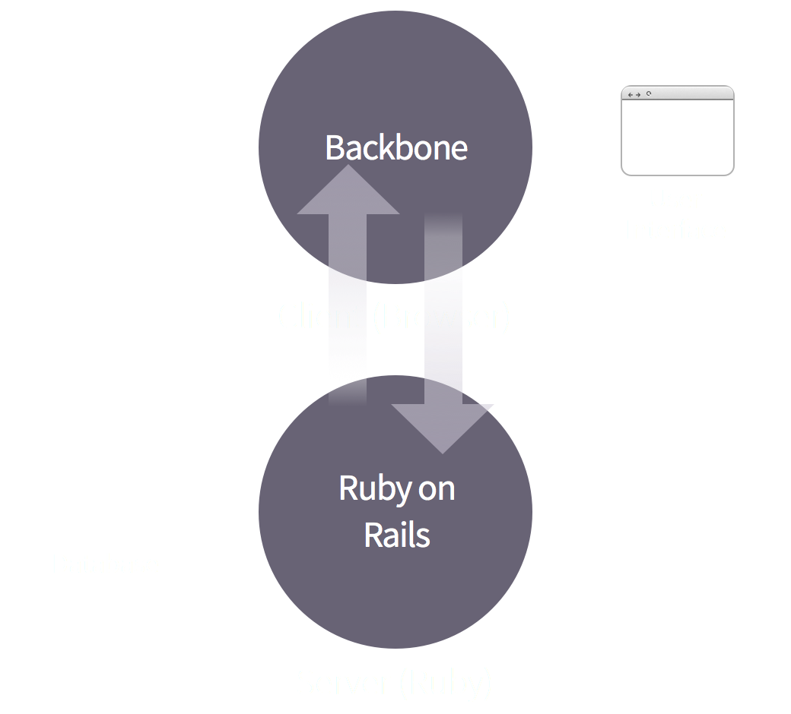</p>


## Server-Side JavaScript
<p>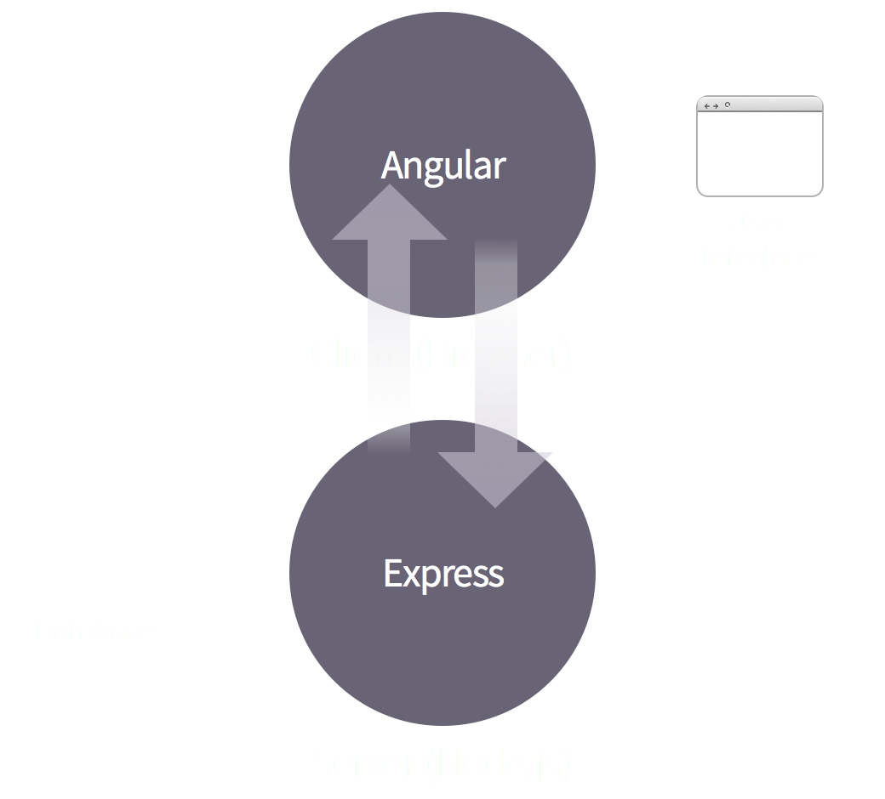</p>


## Full-Stack JavaScript
<p>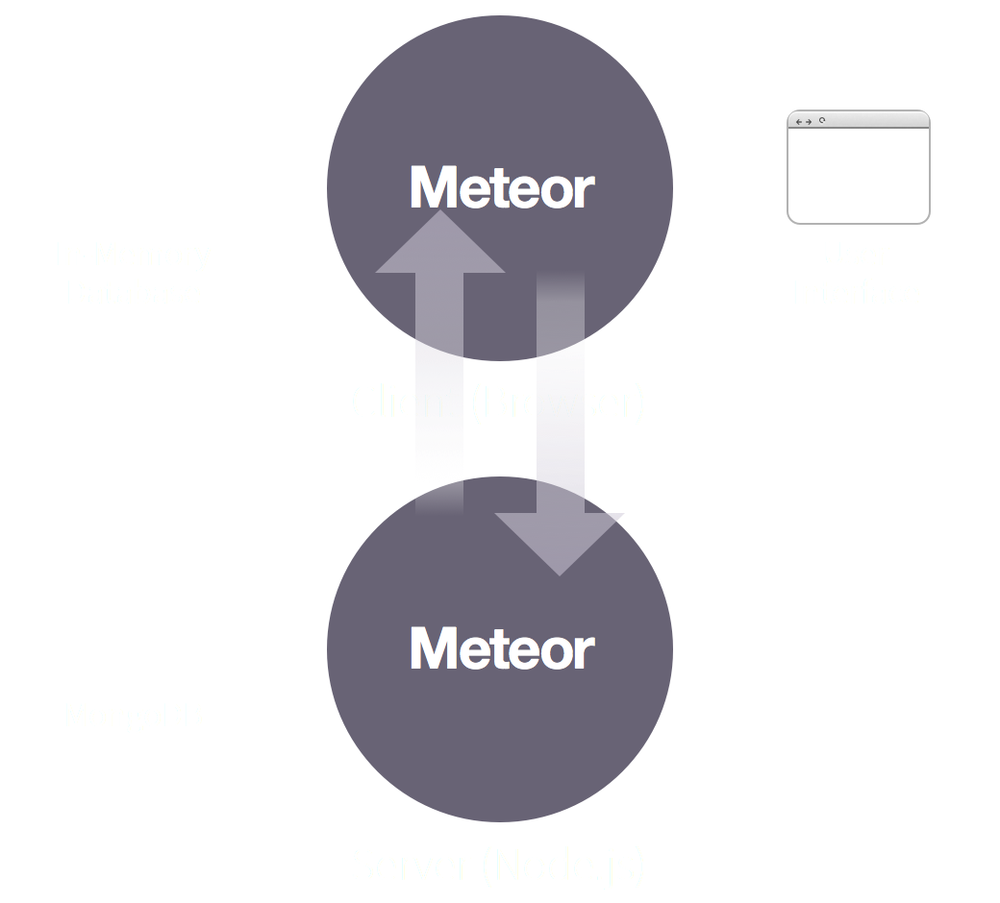</p>
<!-- Meteor is a JavaScript framework with both server-side and client-side components. -->


# Three Meteor Principles


## Data on the Wire
<p>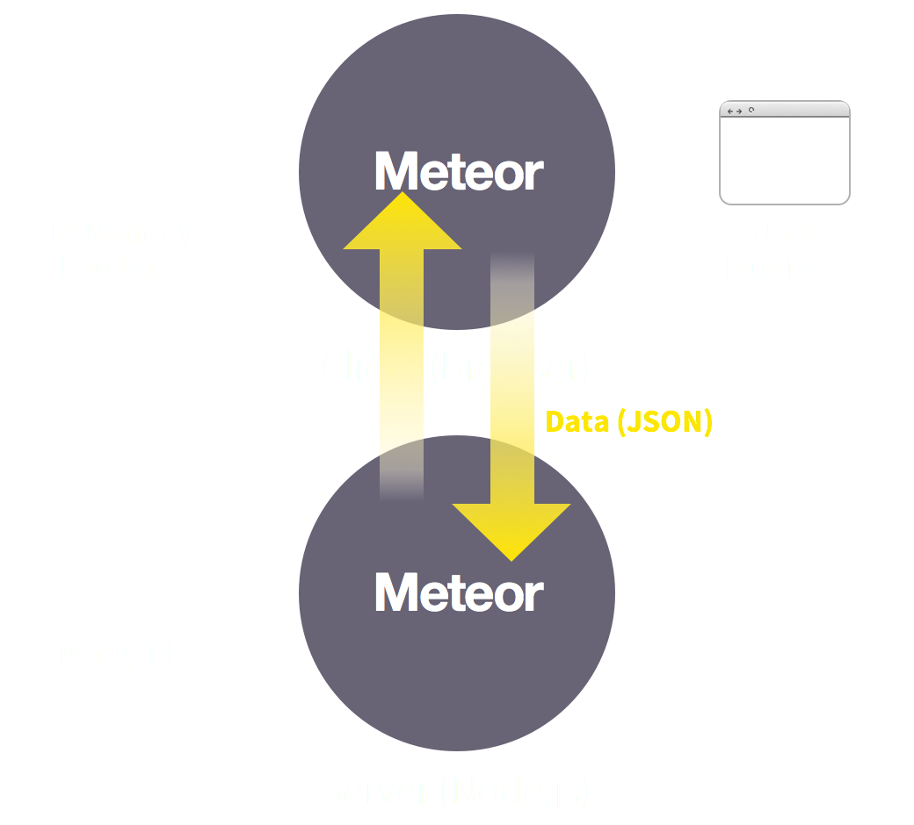</p>
<!-- The client front-loads all HTML, CSS, and JavaScript code necessary to the app when you first connect, then after that only receives data.  -->


## Database Everywhere
<p>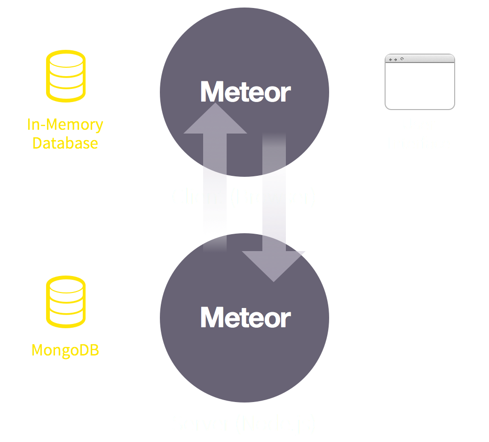</p>
<!-- Meteor replicates a subset of the database in the browser's memory for easy access. -->


## Reactivity
<p>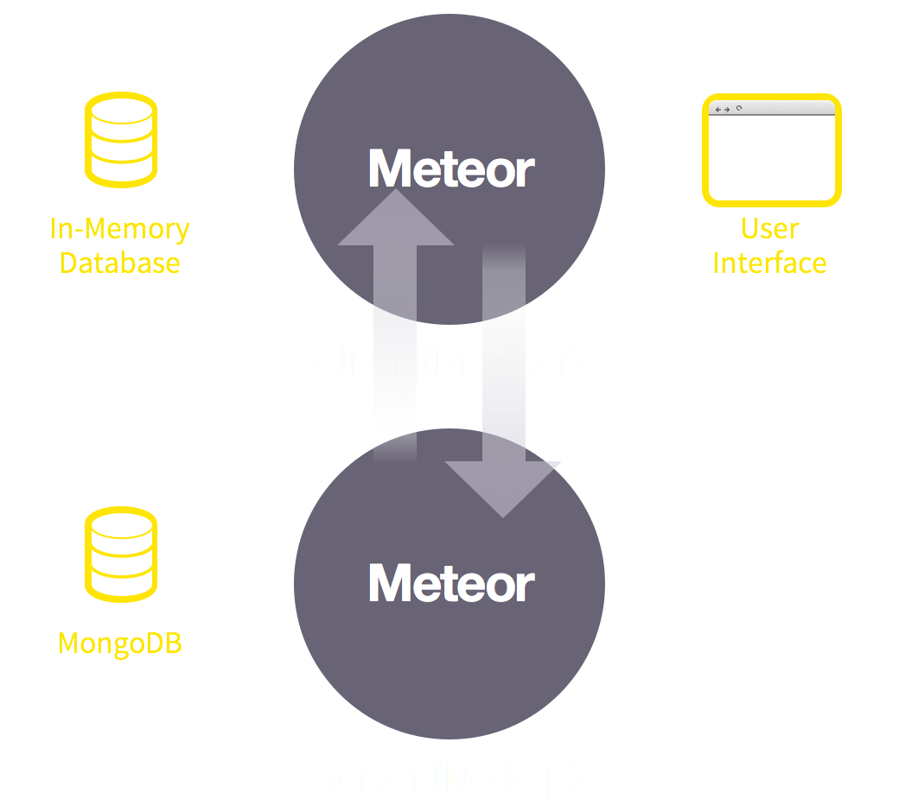</p>
<!-- Any modification to the server-side database is reflected in real-time on the client. -->


# A Few More Cool Things…


## Everything Included
Meteor automatically loads any HTML, CSS, or JavaScript file included in a repository.


## Hot Code Reload
Any change to an app's source files automatically triggers a browser refresh.


## Recap
Meteor takes existing technologies and makes them work together seamlessly, on both client and server. 


# What We're Building


## Dribbble
A community site that lets you post and vote on design work.


<p>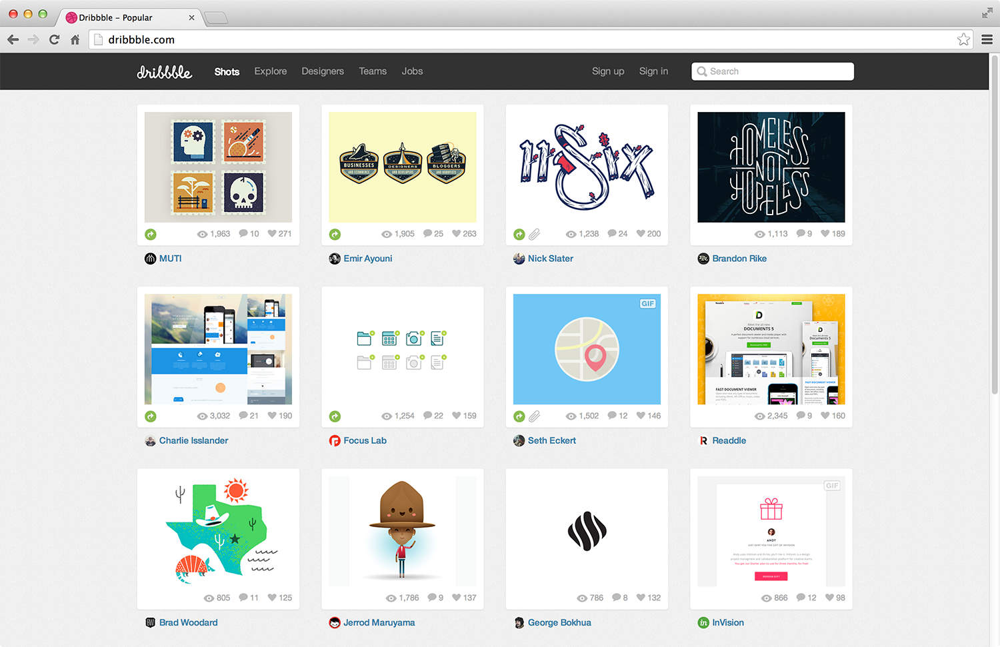</p>
The Dribbble homepage: the 12 most popular “shots”.


## Grid + Dribbble = Gribbble
Showing the Dribbble homepage over the past 12 hours. 


<p>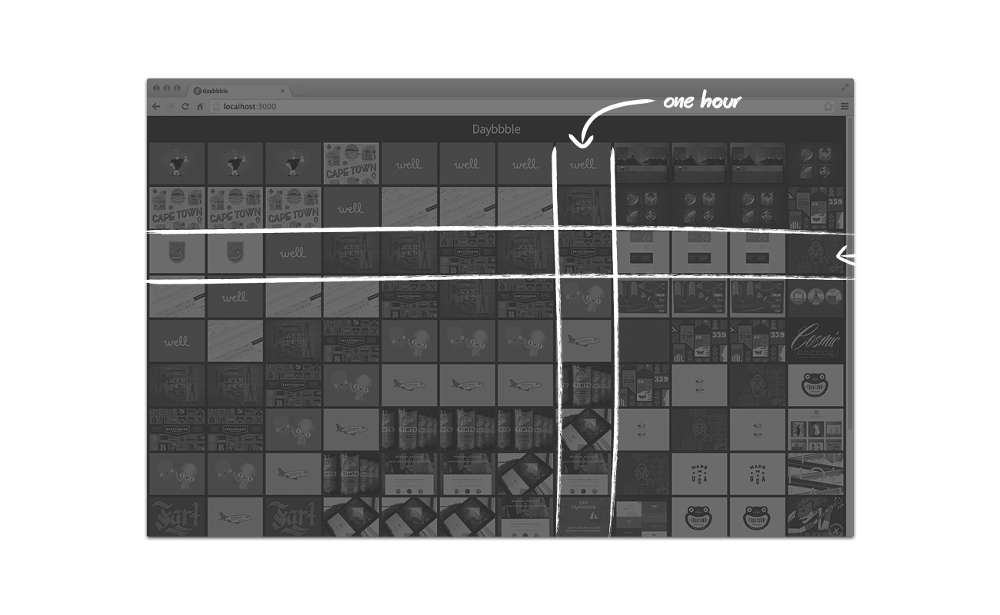</p>
A grid of the homepage over time.


<p>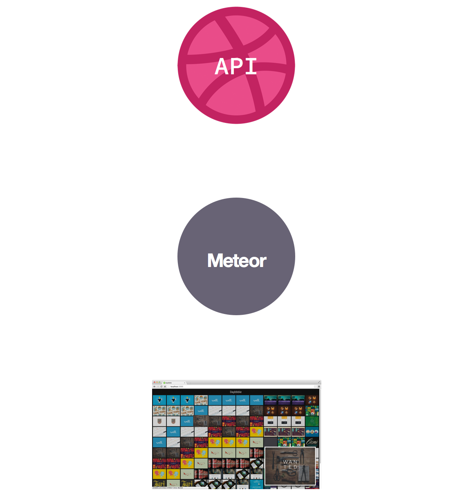</p>


## The App
<!-- <a href="javascript:void(0)" class="commit-link" data-value="master">Show Me!</a> -->


# Step 1: Setting Up


## Install Meteor
```bash
curl https://install.meteor.com | /bin/sh
```


## Create an App
Create the app.
```bash
meteor create gribbble
```
Open the app's directory.
```bash
cd gribbble
```


## Run the App
```bash
meteor
```
<a href="javascript:void(0)" class="commit-link" data-value="c1-1">Run</a>


## Create the File Structure
- Remove Meteor's placeholder files.
```bash
rm gribbble.css gribbble.html gribbble.js
```
- Create three directories
```bash
mkdir client
mkdir server
mkdir collections
```
- Copy-paste the stylesheet into `client/style.css`.
<a href="javascript:void(0)" class="commit-link" data-value="c1-2">Run</a>


## Recap
We now have a working Meteor app. Let's make it actually do something!


# Step 2: Collecting Data


## Create a Collection
```js
Snapshots = new Meteor.Collection('snapshots');
```
<div class="file">`/collections/snapshots.js` (both)</div>
<a href="javascript:void(0)" class="commit-link" data-value="c1-3">Run</a>
<p class="test">`Snapshots.find().fetch()`</p>


## The Dribbble API
<div class="smaller">`http://api.dribbble.com/shots/popular?per_page=12`</div>


<p>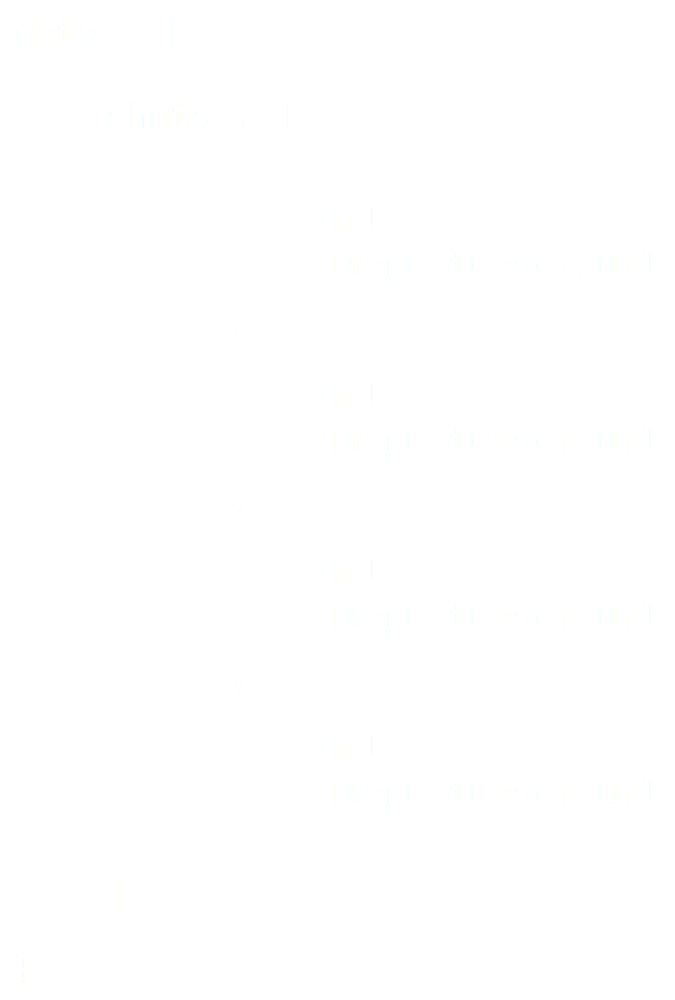</p>


## Query the Dribbble API
```bash
meteor add http
```

```js
var url="http://api.dribbble.com/shots/popular?per_page=12";

var queryAPI = function () {
  HTTP.get(url, function(error, result){
    if(result){
      result.timestamp = new Date().getTime();
      Snapshots.insert(result);
    }
  });
}
```
<div class="file">`/server/api.js` (server)</div>
<a href="javascript:void(0)" class="commit-link" data-value="c1-4">Run</a>


## Schedule to Run Every Hour
```js
Meteor.setInterval(function(){
  queryAPI();
}, 3600000);
```
<div class="file">`/server/api.js` (server)</div>
<a href="javascript:void(0)" class="commit-link" data-value="c1-5">Run</a>


## Test the Function
```js
Meteor.methods({
  queryFromClient: queryAPI
});
```
<div class="file">`/server/api.js` (server)</div>
<a href="javascript:void(0)" class="commit-link" data-value="c1-6">Run</a>
<p class="test">`Meteor.call('queryFromClient')`</p>


## Recap
We're now collecting the 12 most popular Dribbble shots every hour. Next step: displaying them. 


# Step 3: Displaying Data


<p></p>


## Preloading Data
Let's preload data into our database. 
```js
var url = 'https://rawgithub.com/SachaG/9798180/raw/ab3c76d1b13578bc7efe66536f4af6f4486cbfb7/Snapshots.json';
$.getJSON(url, function(data){
  _.each(data, function(snapshot){Snapshots.insert(snapshot)});
});
```
(Copy to JavaScript console and run)


## The Main Template
<p>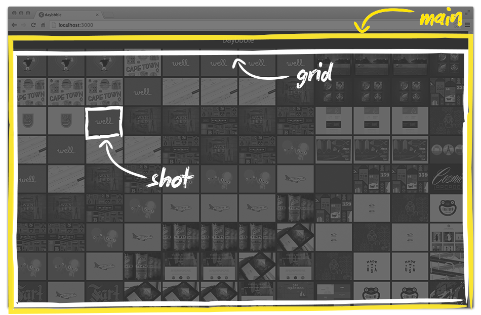</p>


## The Main Template
```html
<head>
  <title>Gribbble</title>
</head>

<body>
  <h1>Gribbble</h1>
  {{> grid}}
</body>
```
<div class="file">`/client/main.html` (client)</div>
<a href="javascript:void(0)" class="commit-link" data-value="c2-1">Run</a>


## The Grid
<p>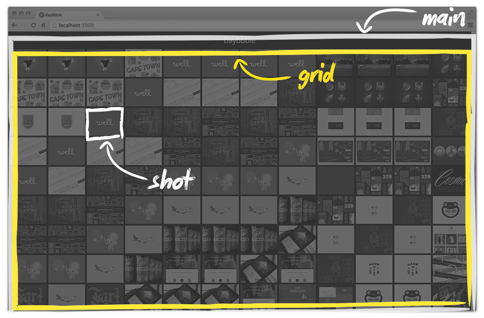</p>


## The Grid
```html
<template name="grid">
  <div class="grid">
    {{#each snapshots}}
      <div class="grid-snapshot grid-col">
        {{timestamp}}
      </div>
    {{/each}}
  </div>
</template>
```
<div class="file">`/client/grid.html` (client)</div>
<a href="javascript:void(0)" class="commit-link" data-value="c2-2">Run</a>


## Fill The Grid With Data
```js
Template.grid.helpers({
  snapshots: function () {
    return Snapshots.find({}, {
      sort: {timestamp: -1}, 
      limit: 12
    });
  }
});
```
<div class="file">`/client/grid.js` (client)</div>
<a href="javascript:void(0)" class="commit-link" data-value="c2-3">Run</a>


## Loop Over The Shots
```html
<template name="grid">
  <div class="grid">
    {{#each snapshots}}
      <div class="grid-snapshot grid-col">
        {{#each data.shots}}
          <p>{{title}}</p>
        {{/each}}
      </div>
    {{/each}}
  </div>
</template>
```
<div class="file">`/client/grid.html` (client)</div>
<a href="javascript:void(0)" class="commit-link" data-value="c2-4">Run</a>


## The Shot
<p>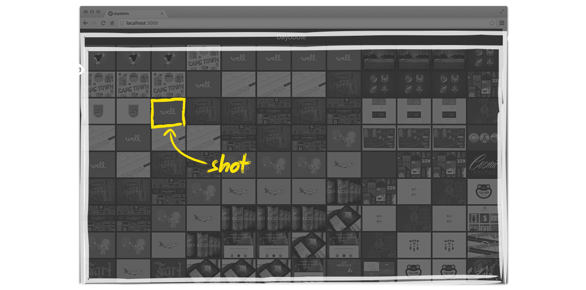</p>


## Add Shot Template
```js
<template name="shot">
  <a href="{{url}}" target="_blank" class="grid-shot">
    
  </a>
</template>
```
<div class="file">`/client/shot.html` (client)</div>
<a href="javascript:void(0)" class="commit-link" data-value="c2-5">Run</a>


## Include Shot Template
```html
<template name="grid">
  <div class="grid">
    {{#each snapshots}}
      <div class="grid-snapshot grid-col">
        {{#each data.shots}}
          {{>shot}}
        {{/each}}
      </div>
    {{/each}}
  </div>
</template>
```
<div class="file">`/client/grid.html` (client)</div>
<a href="javascript:void(0)" class="commit-link" data-value="c2-6">Run</a>


## Recap
We're storing and displaying data. We now need to control the flow of data from server to client. 


# Step 4: Controlling Data


<p>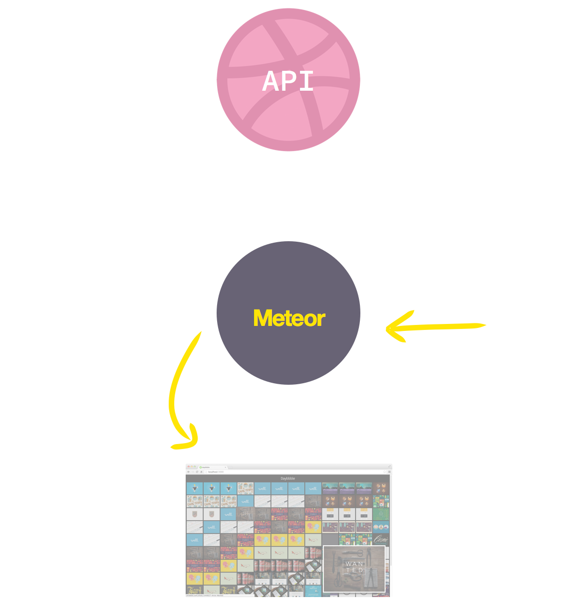</p>


## Remove Packages
```bash
meteor remove autopublish
meteor remove insecure
```
<a href="javascript:void(0)" class="commit-link" data-value="c3-1">Run</a>
<p class="test">`Snapshots.find().fetch()`</p>


<p></p>


## Add a Publication
```js
Meteor.publish('snapshots', function(limit) {
  return Snapshots.find({}, {
    sort: {timestamp: -1}, 
    limit: limit
  });
});
```
<div class="file">`/server/publications.js` (server)</div>
<a href="javascript:void(0)" class="commit-link" data-value="c3-2">Run</a>


<p></p>


## Subscribe to the Publication
```js
Meteor.subscribe('snapshots', 12);
```
<div class="file">`/client/main.js` (client)</div>
<a href="javascript:void(0)" class="commit-link" data-value="c3-3">Run</a>
<p class="test">`Snapshots.find().fetch()`</p>


## Recap
We've set rules controlling what data is made available to the client, as well as what part of the data the client will actually ask for. Now let's get fancy.


# Step 5: Getting Fancy


## Set Up Hover Events
```js
Template.shot.events({
  'mouseenter': function (event) {
    Session.set('zoomedShot', this);
  },
  'mouseleave': function (event) {
    Session.set('zoomedShot', null);
  }
});
```
<div class="file">`/client/shot.js` (client)</div>
<a href="javascript:void(0)" class="commit-link" data-value="c4-1">Run</a>
<p class="test">`Session.get('zoomedShot')`</p>


## The Zoom
<p>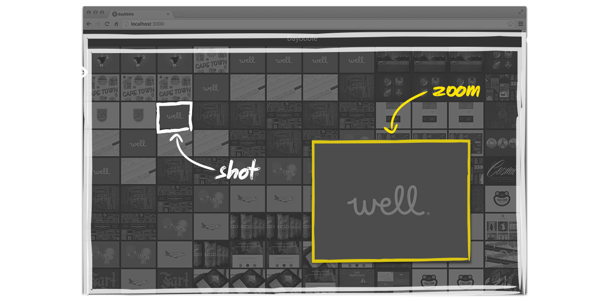</p>


## Add a Zoom Template
```html
<template name="zoom">
  <div class="zoom-shot">
    {{> shot zoomedShot}}
  </div>
</template>
```
<div class="file">`/client/zoom.html` (client)</div>
<a href="javascript:void(0)" class="commit-link" data-value="c4-2">Run</a>


## Add the Zoom Helper
```js
Template.zoom.helpers({
  zoomedShot: function () {
    return Session.get('zoomedShot');
  }
});
```
<div class="file">`/client/zoom.js` (client)</div>
<a href="javascript:void(0)" class="commit-link" data-value="c4-3">Run</a>


## Include the Zoom Template
```html
<body>
  <h1>Gribbble</h1>
  {{> grid}}
  {{> zoom}}
</body>
```
<div class="file">`/client/main.html` (client)</div>
<a href="javascript:void(0)" class="commit-link" data-value="c4-4">Run</a>


## Add a Parameter to the Publication
```js
Meteor.publish('snapshots', function(limit, skip) {
  return Snapshots.find({}, {
    sort: {timestamp: -1}, 
    limit: limit, 
    skip: skip
  });
});
```
<div class="file">`/server/publications.js` (server)</div>
<a href="javascript:void(0)" class="commit-link" data-value="c4-5">Run</a>


## Add a Parameter to the Subscription
```js
Session.get('skip', 0);

Deps.autorun(function(){
  Meteor.subscribe('snapshots', 12, Session.get('skip'));
});
```
<div class="file">`/client/main.js` (client)</div>
<a href="javascript:void(0)" class="commit-link" data-value="c4-6">Run</a>
<p class="test">`Session.set('skip', Session.get('skip')+1)`</p>


## Add a Loading Screen
```html
<body>
  <h1>Gribbble</h1>
  {{> grid}}
  {{> zoom}}
  <div class="loading"></div>
</body>
```
<div class="file">`/client/main.html` (client)</div>
<a href="javascript:void(0)" class="commit-link" data-value="c4-7">Run</a>


## Hide the Loading Screen
```js
Deps.autorun(function(){
  Meteor.subscribe('snapshots', Session.get('offset'), 
    function () {
      $('.loading').fadeOut('slow');
    });
});
```
<div class="file">`/client/main.js` (client)</div>
<a href="javascript:void(0)" class="commit-link" data-value="c4-8">Run</a>


## Recap
We built a simple web app in less than 100 lines of code, and saw an overview of the main Meteor features. 


## Learn More
- [Learn Meteor](https://www.meteor.com/learn-meteor)
- [Evented Mind](https://www.eventedmind.com/)
- [MeteorHacks](http://meteorhacks.com/)


## Our Book
<p></p>


# Thanks!
#### Now go and build something cool :)